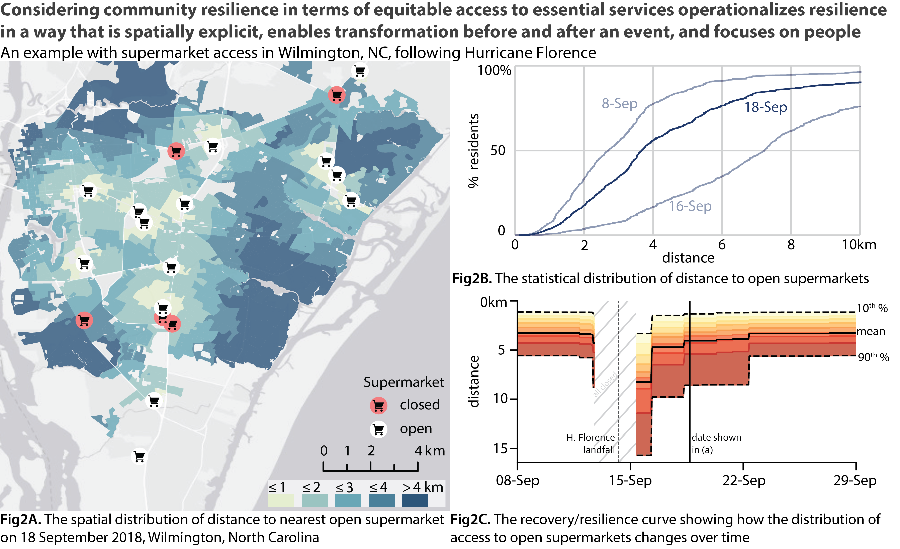

# Resilience as access to essential services: A Methodology and Approach for Measuring and Operationalizing Community Resilience

Tom M Logan  
www.tomlogan.co.nz

#### Please cite this code as:  
Logan, T. M. & Guikema, S. D. Reframing Resilience: Equitable Access to Essential Services. Risk Analysis (2020)

This repo provides information and code on how to conduct the equitable access to essentials (EAE) approach to community resilience.

## Files

    |- src/
        |- query.py
        |- proximity_over_time.py
        |- plot.py

## Steps
### Setup the OSRM server  
* First, follow the steps to pull the docker image for osrm-backend: https://hub.docker.com/r/osrm/osrm-backend/  
* in powershell, change dir into data\osm  
* start windows bash (or be doing this in linux)  
* download the osm data for the state  
``wget http://download.geofabrik.de/north-america/us/maryland-latest.osm.pbf``  
* exit the bash: `exit`
* extract the data  
``docker run -t -v B:\research\resilience\data\osm:/data osrm/osrm-backend osrm-extract -p /opt/foot.lua /data/maryland-latest.osm.pbf``  
sometimes I get this error when I run the above line "[error] Input file /data/maryland-latest.osm.pbf not found!"  
this is solved by restarting docker (like the overall Docker instance on the computer - note I'm running on Windows)  
* ``docker run -t -v B:\research\resilience\data\osm:/data osrm/osrm-backend osrm-partition /data/maryland-latest.osrm``  
* ``docker run -t -v B:\research\resilience\data\osm:/data osrm/osrm-backend osrm-customize /data/maryland-latest.osrm``
* set up the OSRM docker container for querying  
``docker run --name osrm-md -t -i -p 5555:5000 -v B:\research\resilience\data\osm:/data osrm/osrm-backend osrm-routed --algorithm mld /data/maryland-latest.osrm``
* Then we can check that it's working with (e.g.) Sinai Hospital (-76.662008,39.353236) to The Johns Hopkins Hospital (-76.591717,39.296203). This should take ~ 2hour 16min (136 min) and be 10.7km according to Google Maps.  
Put this in your browser's URL: "http://127.0.0.1:5555/route/v1/walking/-76.662008,39.353236;-76.591717,39.296203?steps=false"  
for me this gives a distance of 10950m and a duration of 7964.6 (7964.6/60=132.7433min) so that's about right.  
* You can stop the docker with `ctrl+c`  
and restart it with ``docker restart osrm-md``

### Creating the PostGres database
* connect to the database server
* create the db
`CREATE DATABASE access_fl_pan;`  
* init postgis
`\c md;`  
`CREATE EXTENSION postgis;`  
`\q`

### Add the city block data to the database
* ideally clip the block data to the boundary of the region you want to evaluate
* before adding to the db you need the EPSG code. You can find this in the shapefile metadata: open ArcGIS Pro, open the layer properties, source, spatial reference, WKID: 4269
* enter bash
* cd to directory with shapefile
* `shp2pgsql -I -s 4269 pan_block.shp block | psql -U postgres -d access_fl_pan -h 132.181.102.2 -p 5001`

### Add the city demographic data to the db
* download the data from the IPUMS NHGIS site (use my extract history: block level shapefile for the state and a csv for the racial composition of the blocks)
* cd into the src directory
`python`  
`from query import *`  
`import_csv()`  
* in the script `query.py` use the function `import_csv`

### Download the destination files
* look here for the amenities: https://wiki.openstreetmap.org/wiki/Key:amenity
* schools: https://data.baltimorecity.gov/dataset/BCPSS-School/y4x7-8za4  
	in ArcGIS Pro I subset to include everything K - 5  
  then exported the new layer as primary_schools (guess American's call them elementary)
* libraries:  https://data.baltimorecity.gov/Culture-Arts/Library-Shape/drrv-65mc
* supermarkets. Downloaded a kml from overpass turbo (shop=supermarket)
  * import the kml into arcgis pro
  * feature to point: on the polygons to get the centroid of the supermarkets
  * join the two layers with `merge` tool
  * select the stores within and near baltimore city limits
  * save the .shp - disable the Z layer
* hospital: https://data.baltimorecity.gov/dataset/Hospital/hrs6-bsyt

### Add the destinations to the database
* See the code `create_dest_table` in `query.py`
* you can check if you're code is querying OSRM using
`docker logs -f osrm-md`

### Determine the distance to services
* Calculate the network distance from every block to every service
* `query.py`

### Determine the nearest service
* `proximity_over_time.py`
